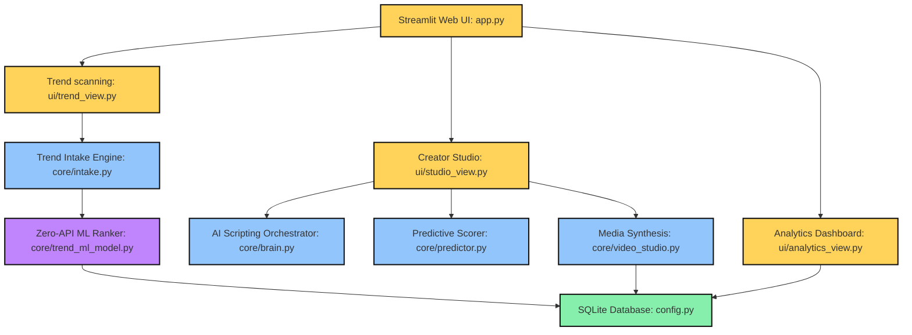
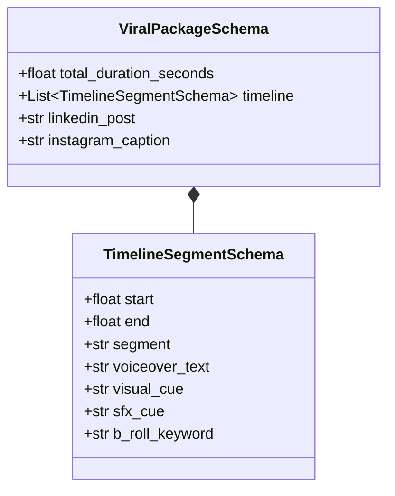
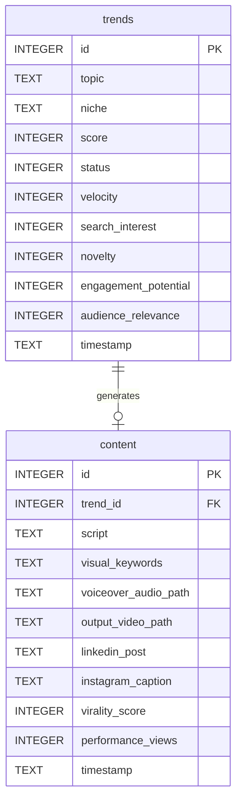
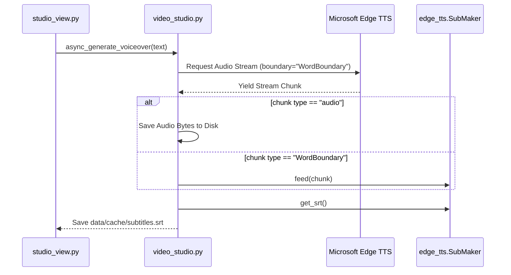
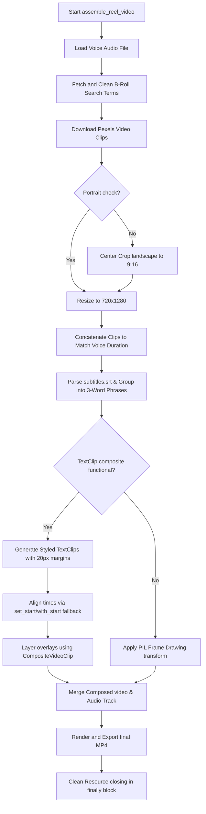

# CreatorBuddy AI — Core Project Overview & Technical Report

Welcome to the **CreatorBuddy AI** system documentation. This comprehensive, "hair-to-toe" overview acts as a central blueprint explaining every service, class, module, database schema, algorithm, and media composition pipeline integrated within the CreatorBuddy ecosystem.

---

## 1. System Architecture

CreatorBuddy is structured following a high-fidelity **Decoupled Three-Tier SaaS Architecture**:



---

## 2. Core Service Deep-Dive

### 2.1 UI Presentation Layer (Streamlit & Custom CSS)

The user interface adopts a high-end **Vibrant Cartoon Neo-Brutalist Drafting Aesthetic**:
* **`app.py`**: The main entry point. It configures the overall theme, registers session states, injects the full-screen dotted drafting grid background (`.cb-dot-grid`), and renders the side border glow columns (`.cb-pillars`). It manages the tab-based navigation spanning Trend Discovery, Creator Studio, and Performance Analytics.
* **`ui/trend_view.py`**: Manages search query submission, triggers the ML trend scoring engine, and renders metrics (Growth, Novelty, Interest) alongside the explainable AI sensitivity breakdowns.
* **`ui/studio_view.py`**: Controls script synthesis and timelines. Provides users with inline script editing and renders the video player displaying the rendered `.mp4`.
* **`ui/analytics_view.py`**: Pulls past runs from SQLite to chart audience retention metrics and view counts.

---

### 2.2 Local Machine Learning Layer (Zero-API cost)

* **`core/trend_ml_model.py`**:
  * **Static Historical Database**: Contains a statically preloaded training set of 150 successful viral trend profiles.
  * **RandomForestRegressor Ensemble**: Trains an ensemble of 100 decision trees to calculate the compound viral weight of incoming trends.
  * **Numpy Fallback Model**: Uses a pure Python multi-layered Non-Linear Ridge Regression model if `scikit-learn` is missing, preventing system crashes.
  * **Explainable AI (XAI)**: Calculates the percentage contribution of each metric using a perturbation analysis delta ($\pm10\%$) and normalizes the standard deviations:
    $$\text{Importance}(x_i) = \text{std\_dev}\left(f(X \pm \delta_i)\right)$$

---

### 2.3 AI Scriptwriting Orchestrator Layer

* **`core/brain.py`**:
  * **Official Google GenAI SDK**: Uses `google-genai` to interact with `gemini-2.5-flash`.
  * **Evolutionary Context Memory**: Automatically queries SQLite for the top 3 highest-rated scripts in the active niche and feeds them into the generation context to train the scriptwriter over time.
  * **Structured Schema Validation**: Enforces exact JSON schemas for B2B social copy, captions, timestamps, and video visual cues:



---

### 2.4 Predictive Scoring Layer

* **`core/predictor.py`**:
  * Evaluates the generated script's virality before compilation.
  * **Flesch Reading Ease Formula**: Analyzes readability by examining sentence structures and syllable counts:
    $$\text{Flesch Score} = 206.835 - 1.015 \left(\frac{\text{words}}{\text{sentences}}\right) - 84.6 \left(\frac{\text{syllables}}{\text{words}}\right)$$
  * **Copywriting Structure Audits**: Checks hook power, the transition structure (Hook $\to$ Story $\to$ Insights $\to$ CTA), and direct CTA keywords to issue improvements.

---

### 2.5 Media Synthesis Layer (flawless Subtitle Sync)

* **`core/video_studio.py`**:
  * **Asynchronous Voice Streaming**: Streams chunks from the Microsoft Edge TTS engine using `boundary="WordBoundary"`.
  * **Event-Driven Subtitle Capture**: Feeds individual `"WordBoundary"` ticks (offset timings) directly into `edge_tts.SubMaker` to generate microsecond-accurate SRT captions.
  * **Pause-Aware Phrase Grouping**: Groups individual words into 2-3 word segments to improve readability. Phrases split when pauses exceed `0.35 seconds`:

```
   Word Timings Stream:
   [Hello (0.1s)] --> [World (0.5s)] --> (pause: 0.45s) --> [Welcome (1.05s)]
   
   Grouped Cues Output:
   1. "HELLO WORLD" (0.1s - 0.5s)
   2. "WELCOME" (1.05s - 1.35s)
```

  * **Pexels Portrait HD Pipeline**: Simplifies search parameters, checks aspect ratios, and crops landscape videos to a portrait 9:16 aspect ratio:
    $$\text{target\_width} = h \times \frac{9}{16}$$
  * **Cross-Version MoviePy Timing**: Uses fallback methods for `.with_start()`/`.with_end()` (MoviePy v2.x) and `.set_start()`/`.set_end()` (MoviePy v1.x) to support different environments.
  * **Zero-Clipping Margins**: Adds `margin=(20, 20)` to `TextClip` properties to prevent outline strokes from clipping at text box borders.
  * **Memory Leak Prevention**: Uses a robust `finally` block to execute `.close()` on all loaded video, audio, text, and composite clips.

---

## 3. Data Pipelines & Mappings

The database schema (defined in `config.py`) is structured as follows:



---

## 4. Key Execution Flows

### 4.1 Voiceover & Subtitle Extraction Flow



### 4.2 Timeline Composition Flow


